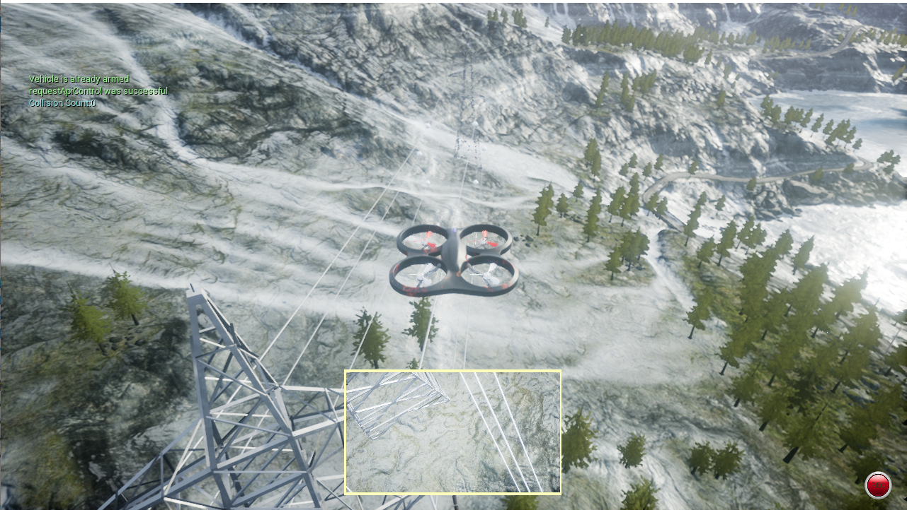

# Powerlline-Tracking-using-drone-in-AirSim
Powerline tracking using a drone with normal RGB camera and the detection was done using Hough transform, the project was done inside AirSim in it's Mountain Landscape enviroment (with power lines) (v1.2.1 - Windows)

###Watch a demo for the project
[](https://www.youtube.com/watch?v=JwZd0n0tk78)
###Steps to run the simulator 
Run the desired environment (in this case)
```
.\run.bat
```
Then run the mvp python script
```
python .\mvp.py
```